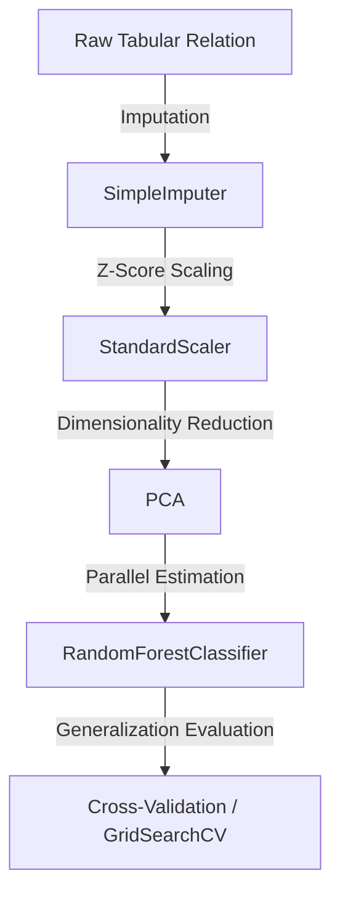

# 📊 NumJa: High-Performance Matrix Algebra & Statistical Learning Framework for Java
> **Release Version 0.2.0 - Closed-Source Modular Release**
> NumJa is a high-performance, zero-dependency, and mathematically rigorous matrix algebra and statistical learning library developed natively for the Java Virtual Machine (JVM). It offers an intuitive, Python-equivalent syntax simulating NumPy, Pandas, Matplotlib, Seaborn, and Scikit-Learn, optimized for low-latency offline executions.

---

## 🔬 Scientific Abstract & Motivation
In scientific computing and data science, the Python ecosystem (NumPy, SciPy, Scikit-Learn) has established dominance due to expressive API semantics and vectorized execution. However, deploying these models onto the JVM often introduces significant JNI overhead, dependency conflicts, or deployment complexities. 

**NumJa** bridges this gap by introducing a native, fully modular, and highly optimized mathematical framework. By wrapping underlying multi-threaded BLAS-like routines, NumJa enables high-throughput matrix-oriented data pipelines directly within the JVM. Furthermore, the compiled modules are protected via advanced **ProGuard Obfuscation** to secure proprietary algorithmic assets during offline deployment.

---

## 📦 Architectural Specifications & Decoupling

NumJa is distributed as a suite of five decoupled, highly interoperable JAR modules targeting Java 11 through Java 25+:

```text
dist/
├── numja.jar          ✅ 1D vector & 2D matrix representations (NDArray) & matrix decompositions
├── pandas.jar         ✅ Labeled relational manifolds (DataFrame & Series) & CSV parser
├── matplotlib.jar     ✅ 2D plotting state-machine & high-performance grid renderer (imshow)
├── seaborn.jar        ✅ Confusion matrix visualizers & statistical heatmaps
└── sklearn.jar        ✅ Comprehensive machine learning estimators, preprocessing & validation pipelines
```

> [!NOTE]  
> **Closed-Source Release Paradigm:**  
> The underlying implementation source code in `modules/` is mathematically modularized and secured under strict `.gitignore` configurations. Consumers only require the compiled, highly optimized binaries in `dist/` and standard Java dependencies, providing a zero-install, portable offline execution model.

---

## 🚀 Core Scientific Modules & Mathematical Formulations

### 📊 1. NumJa Core: Dense Vector & Matrix Algebra
Handles 1D vector and 2D matrix representations and rigorous numerical linear algebra.

* **Vector & Matrix Concept:**
  The central class `numja.core.NDArray` wraps EJML's `DMatrixRMaj` to encapsulate dense 1D column vectors ($A \in \mathbb{R}^{d_1}$) and 2D matrices ($A \in \mathbb{R}^{d_1 \times d_2}$), supporting reshaping, transposition, and vectorized operations.
* **General Matrix Multiplication (GEMM):**
  Matrix multiplication on 2D arrays is mapped via parallelized, cache-friendly implementations:
  $$C_{ik} = \sum_{j=1}^{m} A_{ij} B_{jk}$$
* **Linear Algebra Decompositions (`numja.linalg.LinAlg`):**
  Provides accurate implementations of essential numerical algorithms:
  * **Matrix Inverse ($A^{-1}$):** Solved via LU factorization with partial pivoting.
  * **System Solver ($Ax = b$):** Resolves exact linear systems using QR decomposition or Gaussian elimination.
  * **Singular Value Decomposition (SVD):**
    $$A = U \Sigma V^T$$
  * **QR Decomposition:**
    $$A = Q R$$
  * **Eigendecomposition:**
    $$A v = \lambda v$$
  * **Ordinary Least Squares (OLS):**
    $$\min_{x} \|Ax - b\|_2$$

---

### 🐼 2. Pandas: Relational Tabular Analysis
Manages structural data representations under discrete labeled indexing coordinate systems.

* **Laminated Data Structures:**
  Provides the labeled 1D vector `Series` and the 2D tabular matrix `DataFrame`.
* **Descriptive Structural Profiling:**
  The `describe()` routine computes empirical distributions across features:
  $$\{\text{count}, \mu, \sigma, x_{\min}, x_{0.25}, x_{0.50}, x_{0.75}, x_{\max}\}$$
* **Manifold Mappings:**
  * **`loc` (Label Projection):** Coordinate slicing via explicit column/row header tags.
  * **`iloc` (Coordinate Slicing):** Integer-based coordinate indexing projections.
  * **I/O Pipelines:** High-performance, parameterizable `read_csv` and `read_json` parsers supporting separator delimiter $\delta$, custom headers, and indexing keys.

---

### 📈 3. Matplotlib & Seaborn: Two-Dimensional Graphical Visualizations
Implements high-fidelity Cartesian plotting and statistical pixel-level grid rendering.

* **State-Machine Plotting (`Matplotlib`):**
  Manages continuous function mappings (`plot`), discrete scattering distributions (`scatter`), and graphical canvas manipulation (`clf()`, `title()`, `savefig()`).
* **High-Performance Image Grid Rendering (`imshow`):**
  Supports direct intensity mappings of $A \in \mathbb{R}^{m \times n}$ to continuous thermal pixel grid projections, integrating automatic color-bar density bars.
* **Statistical Distribution Mapping (`Seaborn`):**
  Renders labeled confusion matrices and covariance mappings using multi-tonal gradient ramps (`heatmap`).

---

### 🤖 4. SKLearn: High-Dimensional Machine Learning Suite
A fully integrated, multi-threaded numerical estimation framework conforming to the Python **Scikit-Learn** paradigm.



#### 4.1 Numerical Transformations & Scaling (Preprocessing)
* **Standardization:** Transforms variables to conform to standard normal bounds:
  $$z = \frac{x - \mu}{\sigma}$$
* **MinMax Normalization:** Linearly projects domains into $[a, b]$:
  $$x' = a + \frac{(x - x_{\min})(b - a)}{x_{\max} - x_{\min}}$$
* **Robust Scaling:** Uses median $\tilde{x}$ and Interquartile Range (IQR) for high resistance against outliers:
  $$x' = \frac{x - \tilde{x}}{\text{IQR}}$$

#### 4.2 Supervised Learning Models
* **Decision Boundary Impurity Splits:** Tree nodes optimize splits using Gini Index or Information Entropy:
  $$I_{Gini}(p) = 1 - \sum_{i=1}^{k} p_i^2, \quad I_{Entropy}(p) = -\sum_{i=1}^{k} p_i \log_2(p_i)$$
* **Random Forest Ensembles:** Parallelized training of $B$ independent estimators using modern multi-threading (`n_jobs=-1`):
  $$\hat{y} = \operatorname{mode}\{\hat{y}_1, \hat{y}_2, \dots, \hat{y}_B\}$$
* **Neural Network Backpropagation (MLP):** Supports deep neural network architectures containing parameterized activation kernels (Sigmoid, Hyperbolic Tangent Tanh, Rectified Linear Unit ReLU) and categorical Softmax outputs.

#### 4.3 Validation & Optimization Pipelines
* **Composite Estimator Pipelines:** Streamlines structural transformations (`SimpleImputer` ➔ `StandardScaler` ➔ `Estimator`) via the unified `Pipeline` class.
* **Hyperparameter Sweeps:** The `GridSearchCV` class automates search space optimization using multi-threaded execution pipelines (`n_jobs=-1`).

---
**NumJa — Bridging JVM performance with the expressive elegance of mathematical Python.**
